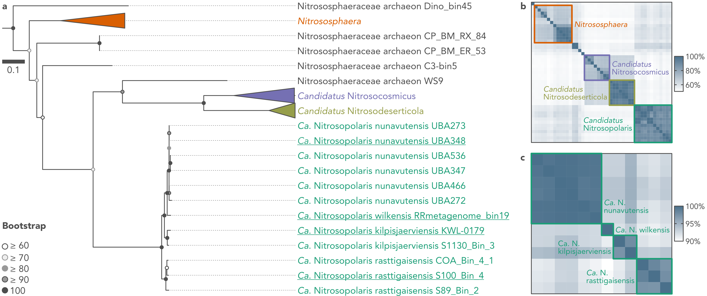

# *Candidatus* Nitrosopolaris



Bioinformatics workflow used in the article:

> Pessi IS, Rutanen A, Hultman J. 2021. *Candidatus* Nitrosopolaris, a genus of putative ammonia-oxidizing archaea with a polar/alpine distribution. FEMS Microbes, doi: [10.1093/femsmc/xtac019](https://doi.org/10.1093/femsmc/xtac019).


## Contacts

**Igor S Pessi**  
Postdoctoral Researcher  
[E-mail](mailto:igor.pessi@gmail.com)

**Jenni Hultman**  
Principal Investigator  
[E-mail](mailto:jenni.hultman@helsinki.fi)


## Table of contents

1. [Before starting](#before-starting)
2. [Download genomes and import to anvi'o](#download-genomes-and-import-to-anvio)
3. [Annotation](#annotation)
4. [Phylogeny and phylogenomics](#phylogeny-and-phylogenomics)
5. [Abundance analysis](#abundance-analysis)


## Before starting

### You will need to have these softwares installed and added to your path

* Entrez Direct v16.2: https://www.ncbi.nlm.nih.gov/books/NBK179288/
* SRA Toolkit v2.11.3: https://github.com/ncbi/sra-tools
* GNU parallel: https://www.gnu.org/software/parallel
* anvi’o v7.0: https://merenlab.org/software/anvio
* Prodigal v2.6.3: https://github.com/hyattpd/Prodigal
* HMMER 3.3: http://hmmer.org
* DIAMOND v0.9.14: https://github.com/bbuchfink/diamond
* BLAST v2.10.1: https://ftp.ncbi.nlm.nih.gov/blast/executables/blast+
* seqtk v1.3: https://github.com/lh3/seqtk
* MUSCLE v3.8.1551: http://www.drive5.com/muscle
* IQ-TREE v2.1.4: http://www.iqtree.org
* pyani v0.2.10: https://github.com/widdowquinn/pyani
* fasterq-dump v2.10.8: https://github.com/glarue/fasterq_dump
* CoverM v0.6.1: https://github.com/wwood/CoverM/
* minimap v2.17: https://github.com/lh3/minimap2

We have used an Atos BullSequana X400 system running the Red Hat Enterprise Linux Server 7.7 (Maipo).  
You should be able to run the analysis with any UNIX-based OS.

### Define number of threads to use

You should change below to the number of cores available in your system:

```bash
NTHREADS=40
```

### Get genome metadata

We have prepared a metadata file that will help us downloading the genome files and running some of the scripts.  
You should download it [here](genomes_metadata.tsv) and move it to where you will be running the analyses.


## Download genomes and import to anvi'o

### Get genomes

```bash
GENOMES=`cut -f 1 genomes_metadata.tsv | sed '1d'`

# Download genomes
mkdir GENOMES_RAW

for GENOME in $GENOMES; do
  esearch -db assembly -query $GENOME | 
  esummary |
  xtract -pattern DocumentSummary -element FtpPath_GenBank |
  awk -F '/' -v OFS='/' '{print $0, $10 "_genomic.fna.gz"}' |
  xargs curl --silent | 
  gunzip > GENOMES_RAW/$GENOME.fa
done
```

### Import to anvi'o

```bash
# Reformat FASTA
mkdir GENOMES

printf '%s\n' $GENOMES |
parallel -I % --bar --max-args 1 'anvi-script-reformat-fasta GENOMES/RAW/%.fa \
                                                             --output-file GENOMES/%.fa \
                                                             --prefix % \
                                                             --simplify-names'

# Create contigs database
mkdir CONTIGSDB

printf '%s\n' $GENOMES |
parallel -I % --bar --max-args 1 'anvi-gen-contigs-database --contigs-fasta GENOMES/%.fa \
                                                            --output-db-path CONTIGSDB/%.db'

# Run HMMs
printf '%s\n' $GENOMES |
parallel -I % --bar --max-args 1 'anvi-run-hmms --contigs-db CONTIGSDB/%.db'

# Build an empty profile database
mkdir PROFILEDB

printf '%s\n' $GENOMES |
parallel -I % --bar --max-args 1 'anvi-profile --contigs-db CONTIGSDB/%.db \
                                               --output-dir PROFILEDB/% \
                                               --sample-name % \
                                               --blank-profile'

# Create map of contigs to bins
for GENOME in $GENOMES; do
  sqlite3 CONTIGSDB/$GENOME.db 'SELECT split FROM splits_basic_info' | awk -v OFS='\t' -v GENOME=$GENOME '{print $0, GENOME}' > PROFILEDB/$GENOME/splits.txt
done

# Import collection
for GENOME in $GENOMES; do
  anvi-import-collection PROFILEDB/$GENOME/splits.txt \
                         --contigs-db CONTIGSDB/$GENOME.db \
                         --pan-or-profile-db PROFILEDB/$GENOME/PROFILE.db \
                         --collection-name $GENOME
done

# Summarize MAGs
mkdir SUMMARIES

for GENOME in $GENOMES; do
  anvi-summarize --contigs-db CONTIGSDB/$GENOME.db \
                 --pan-or-profile-db PROFILEDB/$GENOME/PROFILE.db \
                 --output-dir SUMMARIES/$GENOME \
                 --collection-name $GENOME
done
```


## Annotation

### Annotate MAGs

```bash
mkdir GENE_CALLS
mkdir ANNOTATION

GENOMES=`grep Nitrospolaris genomes_metadata.tsv | cut -f 1`

# Get sequences for gene calls
printf '%s\n' $GENOMES |
parallel -I % --bar --max-args 1 'anvi-export-gene-calls --contigs-db CONTIGSDB/%.db \
                                                         --output-file GENE_CALLS/%.txt \
                                                         --gene-caller prodigal \
                                                         --skip-sequence-reporting'

printf '%s\n' $GENOMES |
parallel -I % --bar --max-args 1 'anvi-get-sequences-for-gene-calls --contigs-db CONTIGSDB/%.db \
                                                                    --output-file GENE_CALLS/%.faa \
                                                                    --get-aa-sequences'

# Annotate against KOfam with HMMER
mkdir ANNOTATION/KOFAM

printf '%s\n' $GENOMES |
parallel -I % --bar --max-args 1 'anvi-run-kegg-kofams --contigs-db CONTIGSDB/%.db'

printf '%s\n' $GENOMES |
parallel -I % --bar --max-args 1 'anvi-export-functions --contigs-db CONTIGSDB/%.db \
                                                        --output-file ANNOTATION/KOFAM/%.txt \
                                                        --annotation-sources KOfam'

# Annotate against PFAM with HMMER
mkdir ANNOTATION/PFAM

printf '%s\n' $GENOMES |
parallel -I % --bar --max-args 1 'anvi-run-pfams --contigs-db CONTIGSDB/%.db'

printf '%s\n' $GENOMES |
parallel -I % --bar --max-args 1 'anvi-export-functions --contigs-db CONTIGSDB/%.db \
                                                        --output-file ANNOTATION/PFAM/%.txt \
                                                        --annotation-sources Pfam'

# Annotate against COG with DIAMOND
mkdir ANNOTATION/COG

printf '%s\n' $GENOMES |
parallel -I % --bar --max-args 1 'anvi-run-ncbi-cogs --contigs-db CONTIGSDB/%.db'

printf '%s\n' $GENOMES |
parallel -I % --bar --max-args 1 'anvi-export-functions --contigs-db CONTIGSDB/%.db \
                                                        --output-file ANNOTATION/COG/%.txt \
                                                        --annotation-sources COG20_FUNCTION'

# Annotate against arCOGS with BLAST
mkdir ANNOTATION/ARCOG

printf '%s\n' $GENOMES |
parallel -I % --bar --max-args 1 'blastp -query GENE_CALLS/%.faa \
                                         -out ANNOTATION/ARCOG/%.txt \
                                         -db arCOGs_2014/ar14 \
                                         -outfmt "6 qseqid sseqid stitle pident qcovs evalue bitscore" \
                                         -max_target_seqs 1 \
                                         -max_hsps 1'
```

### amoABC analysis

```bash
mkdir ANNOTATION/AMO

# Get sequences
for KO in K10944 K10945 K10946; do
  for GENOME in $GENOMES; do
    egrep $KO ANNOTATION/KOFAM/$GENOME.txt | cut -f 1 | 
    seqtk subseq GENE_CALLS/$GENOME.faa - | sed "s/>/>${GENOME}./"
  done > ANNOTATION/AMO/amo.$KO.faa
done 

cat ANNOTATION/AMO/amo.K10944.faa ANNOTATION/AMO/amo.K10945.faa ANNOTATION/AMO/amo.K10946.faa > ANNOTATION/AMO/amo.faa

# BLASTp against KEGG
blastp -query ANNOTATION/AMO/amo.faa \
       -out ANNOTATION/AMO/amo_blast_refseq.txt \
       -db kegg \
       -outfmt "6 qseqid sseqid stitle pident qcovs evalue bitscore" \
       -num_threads $NTHREADS

# BLASTp against RefSeq
blastp -query ANNOTATION/AMO/amo.faa \
       -out ANNOTATION/AMO/amo_blast_refseq.txt \
       -db refseq_protein \
       -outfmt "6 qseqid sseqid stitle pident qcovs evalue bitscore" \
       -num_threads $NTHREADS

# BLASTp against SWISS
blastp -query ANNOTATION/AMO/amo.faa \
       -out ANNOTATION/AMO/amo_blast_swiss.txt \
       -db swiss \
       -outfmt "6 qseqid sseqid stitle pident qcovs evalue bitscore" \
       -num_threads $NTHREADS

# BLASTn against nt
blastn -query ANNOTATION/AMO/amo.fa \
       -out ANNOTATION/AMO/amo_blast_nt.txt \
       -db nt \
       -outfmt "6 qseqid sseqid stitle pident qcovs evalue bitscore" \
       -num_threads $NTHREADS

# BLASTn against database from Alves et al. (2018)

## Get data
wget https://static-content.springer.com/esm/art%3A10.1038%2Fs41467-018-03861-1/MediaObjects/41467_2018_3861_MOESM6_ESM.zip
unzip 41467_2018_3861_MOESM6_ESM.zip

## Make BLAST db
makeblastdb -in AamoA.db_an96.roguesout_epa/AamoA.db_an96.aln.roguesout.fasta \
            -out AamoA.db_an96.roguesout_epa/AamoA.db_an96.aln.roguesout \
            -dbtype nucl

## Run BLAST
blastn -query ANNOTATION/AMO/amo.K10944.fa \
       -out ANNOTATION/AMO/amoA_blast_alves2018.txt \
       -db AamoA.db_an96.roguesout_epa/AamoA.db_an96.aln.roguesout \
       -outfmt "6 qseqid sseqid stitle pident qcovs evalue bitscore" \
       -num_threads $NTHREADS
```


## Phylogeny and phylogenomics

### Get *N. maritimus* for outgroup

```bash
mkdir OUTGROUP

curl https://ftp.ncbi.nlm.nih.gov/genomes/all/GCF/000/018/465/GCF_000018465.1_ASM1846v1/GCF_000018465.1_ASM1846v1_genomic.fna.gz | gunzip > OUTGROUP/N_maritimus_SCM1.fa

anvi-script-reformat-fasta OUTGROUP/N_maritimus_SCM1.fa \
                           --output-file OUTGROUP/N_maritimus_SCM1.clean.fa \
                           --simplify-names

anvi-gen-contigs-database --contigs-fasta OUTGROUP/N_maritimus_SCM1.clean.fa \
                          --output-db-path OUTGROUP/N_maritimus_SCM1.db \
                          --num-threads $NTHREADS

anvi-run-hmms --contigs-db OUTGROUP/N_maritimus_SCM1.db \
              --num-threads $NTHREADS
```

### Make lists

```bash
GENOMES=`cut -f 1 genomes_metadata.tsv | sed '1d'`

printf '%s\t%s\n' name contigs_db_path > external_genomes.txt

for GENOME in $GENOMES; do
  printf '%s\t%s\n' $GENOME $PWD/CONTIGSDB/$GENOME.db 
done >> external_genomes.txt

for GENOME in N_maritimus_SCM1; do
  printf '%s\t%s\n' $GENOME $PWD/OUTGROUP/$GENOME.db 
done >> external_genomes.txt
```

### Phylogenomics

```bash
mkdir PHYLOGENOMICS

# Get amino acid sequences
anvi-get-sequences-for-hmm-hits --external-genomes external_genomes.txt \
                                --output-file PHYLOGENOMICS/76_single_copy_genes.faa \
                                --hmm-source Archaea_76 \
                                --min-num-bins-gene-occurs 36 \
                                --get-aa-sequences \
                                --concatenate-genes \
                                --return-best-hit

# Build phylogenomic tree with IQTREE
iqtree -s PHYLOGENOMICS/76_single_copy_genes.faa \
       -m LG+F+R4 \
       -B 1000 \
       -T $NTHREADS \
       --prefix PHYLOGENOMICS/76_single_copy_genes_iqtree
```

### Compute ANI with pyani

```bash
anvi-compute-genome-similarity --external-genomes external_genomes.txt \
                               --output-dir PYANI \
                               --program pyANI \
                               --num-threads $NTHREADS
```

### 16S rRNA gene phylogeny

```bash
mkdir 16S_rRNA

# Get 16S RNA gene sequences
anvi-get-sequences-for-hmm-hits --external-genomes external_genomes.txt \
                                --output-file 16S_rRNA/sequences.fa \
                                --hmm-source Ribosomal_RNA_16S \
                                --gene-names 16S_rRNA_arc,16S_rRNA_bac

# Align with MUSCLE
muscle -in 16S_rRNA/sequences.fa \
       -out 16S_rRNA/aligned.fa

# Build phylogenetic tree with IQTREE
iqtree -s 16S_rRNA/aligned.fa \
       -B 1000 \
       --prefix 16S_rRNA/16S_rRNA_iqtree
```

### Compute 16S rRNA gene similarity with BLASTn

```bash
makeblastdb -in 16S_rRNA/sequences.fa \
            -out 16S_rRNA/sequences \
            -dbtype nucl

blastn -query 16S_rRNA/sequences.fa \
       -out 16S_rRNA/blast.txt \
       -db 16S_rRNA/sequences \
       -outfmt "6 qseqid sseqid pident qcovs evalue bitscore" \
       -num_threads $NTHREADS
```


## Abundance analysis

First download the metadata for each of the four datasets:

| Dataset                                                                              | Metadata file                                        |
| -------------------------------------------------------------------------------------| -----------------------------------------------------|
| Rásttigáisá, Norway; this study                                                      | [RASTTIGAISA.metadata.tsv](RASTTIGAISA.metadata.tsv) |
| Kilpisjärvi, Finland; [Pessi et al. 2021](https://doi.org/10.1101/2020.12.21.419267) | [KILPISJARVI.metadata.tsv](KILPISJARVI.metadata.tsv) |
| Nunavut, Canada; [Chauhan et al. 2014](https://doi.org/10.1128/genomeA.01217-14)     | [NUNAVUT.metadata.tsv](NUNAVUT.metadata.tsv)         |
| Wilkes Land, Antarctica; [Ji et al. 2017](https://doi.org/10.1038/nature25014)       | [WILKESLAND.metadata.tsv](WILKESLAND.metadata.tsv)   |

### Download metagenomes with fasterq-dump

```bash
mkdir MAPPING

for DATASET in RASTTIGAISA KILPISJARVI NUNAVUT WILKESLAND; do
  mkdir MAPPING/$DATASET
  
  SAMPLES=`cut -f 1 $DATASET.metadata.tsv | sed '1d'`
  
  for SAMPLE in $SAMPLES; do
    fasterq-dump $SAMPLE \
                 --outdir MAPPING/$DATASET \
                 --threads $NTHREADS \
                 --split-files
  done
done
```

### Map reads and calculate relative abundance with Coverm

```bash
GENOMES=`grep Nitrosopolaris genomes_metadata.tsv | cut -f 1`

# Get Nitrosopolaris genomes
mkdir MAPPING/NITROSOPOLARIS_GENOMES

for GENOME in $GENOMES; do
  cp GENOMES/$GENOME MAPPING/NITROSOPOLARIS_GENOMES
done

# Calculate relative abundance with CoverM
for DATASET in RASTTIGAISA KILPISJARVI NUNAVUT WILKESLAND; do
  coverm genome --coupled MAPPING/$DATASET/*.fastq \
                --genome-fasta-files MAPPING/NITROSOPOLARIS_GENOMES/*.fa \
                --output-file MAPPING/$DATASET/coverM_relabund.txt \
                --min-covered-fraction 0 \
                --threads $NTHREADS
done
```
